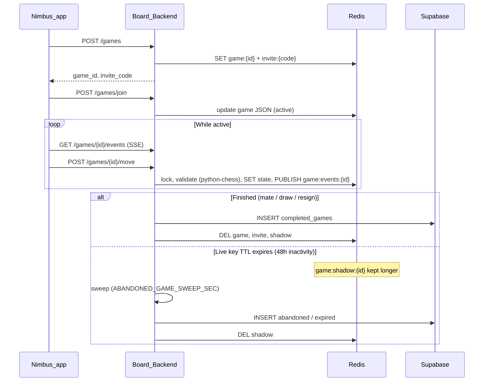

# Board-App - Smart Chess Board Application


---

## Description

Board-App is a comprehensive smart chess board ecosystem that combines hardware, mobile, and AI technologies to create an enhanced chess playing experience. The project consists of a React Native mobile application (Nimbus), a FastAPI backend server, ESP32-based firmware for physical board integration, and an LLM-powered chess coaching assistant.

### Key Features

- **Voice-Controlled Chess** - Speak your moves naturally: "Knight to f3", "Castle kingside", "Queen takes d5"
- **AI Chess Coach** - Get real-time coaching, position analysis, and strategy advice
- **Online Play** - Play against opponents worldwide via Lichess integration
- **Play with Friend** - Create a lobby, share an invite code, and play live chess against friends (Redis-backed state, archived to Supabase when finished)
- **Server Stockfish Analysis** - Live eval during friend games and depth-20 review of archived games (Redis job queue + worker, SSE to Nimbus)
- **Smart Board Integration** - Connect to a physical chess board with automatic piece detection
- **Puzzle Training** - Improve tactical skills with chess puzzles
- **Multi-Platform** - Available on both iOS and Android

## Voice-Controlled Chess AI

The Chess AI Coach allows you to play chess using natural language voice commands:

**Supported Commands:**
- "Move knight to f3" / "Knight f3"
- "Pawn to e4" / "e4"
- "Castle kingside" / "Castle queenside"
- "Queen takes d5" / "Bishop captures c6"
- "Promote to queen"

The AI parses your voice input, validates the move against the current position, and executes it on the board - all hands-free!

**Additional AI Capabilities:**
- Position analysis and evaluation
- Opening recommendations
- Strategic advice tailored to your position
- Endgame guidance

## Hardware Prototype

The hardware prototype is **complete** and fully functional:

- **ESP32 Development Board** - Main microcontroller handling sensor data processing
- **Hall Effect Sensors** - Detect magnetic chess pieces on the board
- **16-Channel Analog Multiplexer** - Reads multiple sensors simultaneously
- **Real-time Detection** - Tracks piece positions with state detection (approaching, over, leaving)

The firmware implements multiplexer control, 12-bit ADC readings, noise reduction algorithms, and serial communication for seamless integration with the mobile app.

## Play with Friend (Redis live state)

Friend chess keeps **active game state in Redis** while players are in a lobby or mid-game. When a game ends normally (checkmate, draw, resign), the API writes one row to Supabase `completed_games` and deletes the Redis keys. If a lobby or game goes stale, a **background sweep** archives it as `abandoned` / `expired`.



| Redis key | Purpose |
|-----------|---------|
| `game:{id}` | Live JSON state (FEN, moves, players, status); **48h TTL** refreshed on each write |
| `invite:{code}` | Maps short invite code → `game_id` |
| `lock:game:{id}` | Short-lived lock for join / move / resign |
| `game:shadow:{id}` | Compact snapshot after live key expires; used by the abandoned-game sweep |
| `game:events:{id}` | Pub/sub channel; SSE subscribers receive live state updates |

**Requirements:** Redis running (`REDIS_URL`), Supabase `completed_games` table (nullable `black_player_id` for empty lobbies). See [Quick Start](#2-redis-required-for-play-with-friend--online-friend-chess) and [Setting up Supabase](#setting-up-supabase). Technical plan: [docs/plans/online-friend-chess.plan.md](docs/plans/online-friend-chess.plan.md).

## Stockfish engine analysis (Redis job queue)

Server-side **Stockfish** runs in separate **`engine-worker`** processes — not in the API. The Docker stack starts **3 workers by default** (up to **3 analyses in parallel**); each worker claims one job from the Redis queue at a time. Nimbus enqueues via `POST /engine/jobs` and streams eval over **SSE** (`GET /engine/jobs/{id}/events`). Job state lives on Redis **db 1** (`REDIS_ENGINE_URL`); friend games stay on **db 0** (`REDIS_URL`).

| Use case | Nimbus screen | API request |
|----------|---------------|-------------|
| Live eval while playing a friend | `friendGame.tsx` | `fen` + depth 12, `profile: play` |
| Review archived game at depth 20 | `onlineFriendGameReview.tsx` | `game_id` + `ply` + depth 20 |

```bash
# After Redis + API are up — start the worker (needs Stockfish binary)
export REDIS_ENGINE_URL=redis://127.0.0.1:6379/1
export STOCKFISH_PATH=$(which stockfish)   # macOS: brew install stockfish
cd Board-Backend && poetry run python -m engine_worker
```

Or use Docker: `./scripts/docker-stack.sh up` (3× `engine-worker` by default — override with `--engine-workers N`; see [docker/stack.yml](docker/stack.yml)).

Details: [docs/complex-logic.md](docs/complex-logic.md) · HTTP reference: [docs/api-routes.md](docs/api-routes.md) · Plan: [docs/plans/stockfish-queue-live-analysis.plan.md](docs/plans/stockfish-queue-live-analysis.plan.md).

## Tech Stack

| Component | Technology |
|-----------|------------|
| Mobile App | React Native (CLI), TypeScript, Tamagui |
| Backend | Python, FastAPI, Supabase, Redis, Stockfish (worker) |
| LLM Service | Python, Hugging Face, FastAPI |
| Firmware | C++, PlatformIO, ESP32 |
| Voice Recognition | @react-native-voice/voice |
| Authentication | JWT, Google OAuth, Lichess OAuth2 |

## Repository layout

| Path | Purpose |
|------|---------|
| `nimbus/` | React Native mobile app |
| `Board-Backend/` | FastAPI backend |
| `Board-LLM/` | Chess coach LLM service |
| `Board-Firmware/` | ESP32 firmware (PlatformIO) |
| [docs/plans/](docs/plans/) | Technical plans; superseded plans go in [docs/plans/archive/](docs/plans/archive/) |
| [tools/hardware-sim/](tools/hardware-sim/) | Optional Python hall-effect / magnet visualization scripts |
| [docs/](docs/) | [API routes](docs/api-routes.md), [architecture](docs/complex-logic.md), [plans](docs/plans/) |
| [scripts/](scripts/) | Dev helpers: install deps, open Terminal tabs, run all services, Docker stack driver |
| [docker/stack.yml](docker/stack.yml) | Compose: Redis + API + **3× engine-worker** + LLM (`scripts/docker-stack.sh`) |

## Requirements

- **Node.js** v18+ (https://nodejs.org/)
- **Python** 3.12+ (https://www.python.org/downloads/)
- **Poetry** for Python dependency management
- **React Native CLI** (not Expo)
- **Android Studio** or **Xcode** for mobile development
- **PlatformIO** for firmware development (optional)

## Quick Start

### 1. Clone & Setup

```bash
git clone <repository-url>
cd Board-App
```

### 2. Redis (required for friend chess + engine analysis)

Friend games use Redis **db 0**; Stockfish jobs use **db 1** (same server). Start Redis before the backend (pick one):

- **Docker (Board-Backend):** `cd Board-Backend && docker compose up -d redis`
- **Docker full stack (repo root):** `./scripts/docker-stack.sh up` (API + LLM + **3× engine-worker** + Redis — see [docker/stack.yml](docker/stack.yml))
- **Homebrew:** `brew install redis && brew services start redis`

Without Redis db 0, `/games` routes return **503**. Without db 1 / `REDIS_ENGINE_URL`, `/engine/*` returns **503**.

On startup the API connects to both databases and runs a **background sweep** every `ABANDONED_GAME_SWEEP_SEC` seconds (default 300) to archive expired friend lobbies from `game:shadow:{id}` into Supabase.

**Stockfish workers (for live eval / review):** Docker stack runs **3 workers** by default (`ENGINE_WORKER_REPLICAS=3`). Host-native dev: install Stockfish (`brew install stockfish`) and run one or more `poetry run python -m engine_worker` processes with `REDIS_ENGINE_URL` and `STOCKFISH_PATH` set.

**Docker shows “Rosetta” errors (Apple Silicon Mac):** Install Apple’s translator once: `softwareupdate --install-rosetta` (or accept the macOS prompt). In **Docker Desktop** → **Settings** → **General**, turn **on** “Use Rosetta for x86_64/amd64 emulation on Apple Silicon” (or **off** if it’s flaky—then prefer **arm64** images only; `redis:7-alpine` is multi-arch). Quit and reopen Docker, then retry `docker compose`. **Workaround:** skip Docker for Redis and use **Homebrew** (`brew install redis && brew services start redis`) with `REDIS_URL=redis://127.0.0.1:6379/0`.

### 3. Start Backend Server

```bash
cd Board-Backend
python -m poetry install
poetry run python api.py 
```

### 4. Start LLM Service

```bash
cd Board-LLM
python -m poetry install
python -m poetry run python llm_service.py
```

### 5. Start Stockfish engine worker (optional — live eval & review)

Required for **Live eval** in friend games and **depth-20** analysis on the review screen.

```bash
cd Board-Backend
export REDIS_ENGINE_URL=redis://127.0.0.1:6379/1
export STOCKFISH_PATH=$(which stockfish)
poetry run python -m engine_worker
```

### 6. Run Mobile App

```bash
cd nimbus
npm install --legacy-peer-deps

# iOS
cd ios && pod install && cd ..
npx react-native run-ios

# Android
npx react-native run-android
```

## Project Structure

```
Board-App/
├── Board-Backend/                 # FastAPI Backend Server
│   ├── api.py                     # Auth, Lichess OAuth, Redis lifespan + abandoned sweep
│   ├── auth.py                    # JWT & OAuth logic
│   ├── game/                      # Friend chess (Redis live state → Supabase archive)
│   │   ├── routes.py              # /games/* endpoints
│   │   ├── service.py             # Redis keys, locks, python-chess, sweep
│   │   └── models.py              # FriendGameState, completed-game summaries
│   ├── engine/                    # Stockfish job enqueue + SSE (no UCI in API)
│   │   ├── routes.py              # /engine/jobs*
│   │   ├── jobs.py, queue.py      # Redis hash + LIST queue helpers
│   │   └── sse.py                 # SSE subscribe-then-snapshot
│   ├── engine_worker/             # Separate process: BRPOPLPUSH + Stockfish UCI
│   ├── Dockerfile.engine-worker   # Worker image (apt install stockfish)
│   ├── docker-compose.yml         # Redis + API + engine-worker
│   └── schemas.py                 # Pydantic models
│
├── Board-Firmware/                # ESP32 Smart Board Firmware
│   └── src/main.cpp               # Hall sensor reading, multiplexer control
│
├── Board-LLM/                     # AI Chess Coach Service
│   ├── llm_service.py             # Chat, analysis, move parsing endpoints
│   └── schemas.py                 # Request/response models
│
└── nimbus/                        # React Native Mobile App
    └── src/
        ├── screens/
        │   ├── chessAI.tsx        # Voice-controlled AI Coach
        │   ├── playMenu.tsx       # Lichess online play
        │   ├── friendGame.tsx     # Play with Friend (lobby, invite, live game)
        │   ├── onlineFriendGameHistory.tsx
        │   ├── onlineFriendGameReview.tsx
        │   ├── play.tsx           # Local games
        │   └── puzzle.tsx         # Puzzle training
        ├── services/
        │   ├── onlineGameHistory.ts   # Completed friend games API client
        │   └── engineAnalysis.ts      # POST /engine/jobs, SSE / poll
        ├── hooks/
        │   └── useEngineAnalysis.ts   # FEN / game_id+ply → live eval state
        ├── components/
        │   └── game/
        │       ├── ChessBoard.tsx
        │       └── EngineEvalBar.tsx
        └── contexts/              # Auth & Lichess contexts
```

## API Endpoints

### Backend Server (Port 8000)

| Endpoint | Method | Description |
|----------|--------|-------------|
| `/token` | POST | User login |
| `/register` | POST | User registration |
| `/auth/google` | POST | Google OAuth |
| `/auth/lichess/login` | GET | Lichess OAuth |
| `/users/me` | GET | Current user info |
| `/users/lichess-info` | GET | Linked Lichess account |
| `/health` | GET | API health; includes Redis connectivity |
| `/games` | POST | Create friend game (returns `game_id`, `invite_code`) |
| `/games/join` | POST | Join by `invite_code` or `game_id` |
| `/games/{id}` | GET | Live game state (Redis) |
| `/games/{id}/move` | POST | Apply SAN move (`python-chess` validation) |
| `/games/{id}/resign` | POST | Resign; archives to Supabase |
| `/games/me/completed` | GET | Your finished / abandoned friend games (Supabase) |
| `/games/me/completed/{id}` | GET | One archived game for review |

| `/engine/jobs` | POST | Enqueue Stockfish analysis (`fen` or `game_id`+`ply`) |
| `/engine/jobs/{id}` | GET | Job status + result |
| `/engine/jobs/{id}/events` | GET | SSE live eval updates |
| `/engine/jobs/{id}/cancel` | POST | Cancel running job |

Friend chess routes return **503** if Redis db 0 is down. Engine routes return **503** if Redis db 1 / `REDIS_ENGINE_URL` is down. Auth required (Bearer JWT) for `/games/*` and `/engine/*`.

Full reference: [docs/api-routes.md](docs/api-routes.md)

### LLM Service (Port 8001)

| Endpoint | Method | Description |
|----------|--------|-------------|
| `/parse-move` | POST | Parse voice/text move commands |
| `/chat` | POST | AI coaching chat |
| `/analyze-chess` | POST | Position analysis |
| `/models` | GET | Available AI models |

## Environment Variables

### Board-Backend (.env)

Create `Board-Backend/.env` (copy from [`Board-Backend/.env.example`](Board-Backend/.env.example)). Typical variables:

```
SUPABASE_URL=your_supabase_url
SUPABASE_KEY=your_supabase_key
GOOGLE_CLIENT_ID=your_google_client_id
SECRET_KEY=your_jwt_secret
REDIS_URL=redis://127.0.0.1:6379/0
REDIS_ENGINE_URL=redis://127.0.0.1:6379/1
ABANDONED_GAME_SWEEP_SEC=300
```

- **`REDIS_URL`** — friend chess (`/games/*`), Redis db **0**. See **Quick Start** → *Redis* above.
- **`REDIS_ENGINE_URL`** — Stockfish job queue (`/engine/*`), Redis db **1**. Worker uses the same URL.
- **`ABANDONED_GAME_SWEEP_SEC`** — how often the API archives **expired Redis lobbies** into `completed_games` (`abandoned` / `expired`). Needs Supabase `black_player_id` nullable — see **Setting up Supabase** → *Create the tables*.

Worker-only (not read by API): `STOCKFISH_PATH`, optional `STOCKFISH_HASH_MB`, `STOCKFISH_THREADS` — see [Board-Backend/.env.example](Board-Backend/.env.example).

See [Setting up Supabase](#setting-up-supabase) for `SUPABASE_URL` / `SUPABASE_KEY`.

---

## Setting up Supabase

The backend uses Supabase for user accounts and Lichess linking. If your project was deprecated or you need a fresh database:

### 1. Create a new Supabase project

1. Go to [supabase.com](https://supabase.com) and sign in.
2. **New project** → choose org, name, database password, region.
3. Wait for the project to be ready.

### 2. Create the tables

1. In the Supabase dashboard, open **SQL Editor**.
2. **New query**.
3. Copy the contents of [`Board-Backend/supabase_schema.sql`](Board-Backend/supabase_schema.sql) and run it.

This creates `users`, `lichess_users`, and `completed_games`. The `completed_games.black_player_id` column is **nullable** so expired lobbies (no opponent joined) can be archived as `abandoned` / `expired`.

**If your project already had `completed_games` from an older script** where `black_player_id` was NOT NULL, run **once** in SQL Editor:

- [`Board-Backend/supabase/migrations/002_completed_games_abandoned.sql`](Board-Backend/supabase/migrations/002_completed_games_abandoned.sql)

Without that migration, the background **abandoned-game sweep** (see `.env.example` `ABANDONED_GAME_SWEEP_SEC`) will fail when it tries to insert a row with no Black player.

**Incremental migrations (alternative to full schema):** you can run [`001_completed_games.sql`](Board-Backend/supabase/migrations/001_completed_games.sql) then, only if needed, `002_…` as above — current `001` already uses a nullable `black_player_id`.

### 3. Get your URL and key

1. In the dashboard, go to **Project Settings** (gear) → **API**.
2. Copy **Project URL** → use as `SUPABASE_URL`.
3. Copy **service_role** key (under "Project API keys") → use as `SUPABASE_KEY`.  
   Use the service role so the backend can read/write without Row Level Security. Keep this key secret.

### 4. Configure the backend

In `Board-Backend/.env` set at least:

```bash
SUPABASE_URL=https://xxxxxxxx.supabase.co
SUPABASE_KEY=eyJhbGc...your_service_role_key
SECRET_KEY=any_long_random_string_for_jwt_signing
REDIS_URL=redis://127.0.0.1:6379/0
REDIS_ENGINE_URL=redis://127.0.0.1:6379/1
ABANDONED_GAME_SWEEP_SEC=300
```

Then start Redis, the API, and (for engine eval) the worker:

```bash
cd Board-Backend
python -m poetry install
poetry run python api.py
```

### 5. (Optional) Restore from your old cluster backup

If you have a Supabase backup (e.g. `db_cluster-13-06-2025@04-25-42.backup (1).gz`) and want to bring over existing users and Lichess links:

1. Create the tables first (step 2 above) with `Board-Backend/supabase_schema.sql`.
2. In the Supabase SQL Editor, run **`Board-Backend/restore_from_backup.sql`**.

That file restores the users and `lichess_users` rows extracted from the backup. **Note:** Lichess access tokens from the backup may be expired; users can re-link their Lichess account in the app.

### Board-LLM (.env)
```
HF_API_TOKEN=your_huggingface_token
DEFAULT_MODEL=mistralai/Mistral-7B-Instruct-v0.3
```

## Mobile App Permissions

**iOS** - Add to `Info.plist`:
```xml
<key>NSMicrophoneUsageDescription</key>
<string>Voice commands for chess moves</string>
<key>NSSpeechRecognitionUsageDescription</key>
<string>Speech recognition for move input</string>
```

**Android** - Add to `AndroidManifest.xml`:
```xml
<uses-permission android:name="android.permission.RECORD_AUDIO" />
```

## License

This project is proprietary software. All rights reserved.
