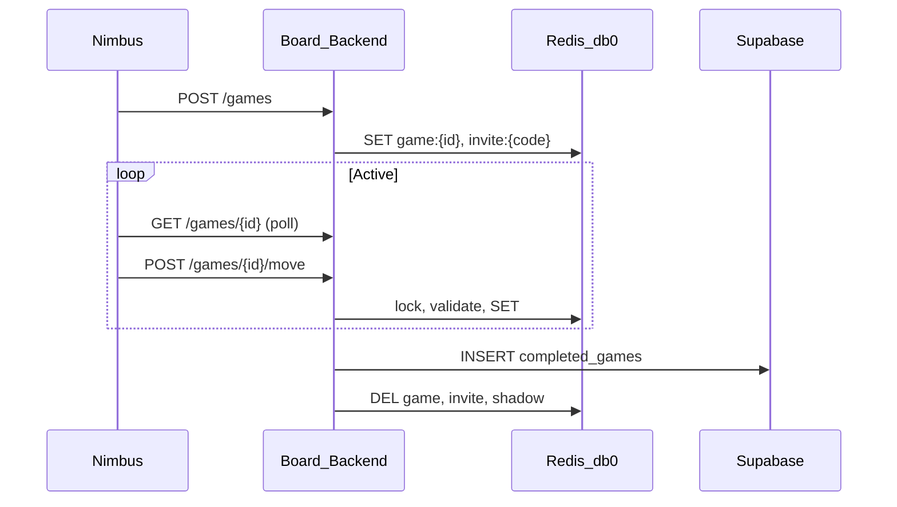
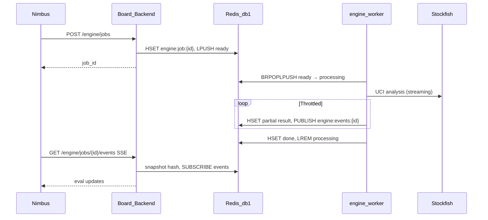

# Complex logic & cross-cutting flows

High-level architecture for friend chess and Stockfish engine analysis. For endpoint tables see [api-routes.md](api-routes.md). Build plan: [plans/stockfish-queue-live-analysis.plan.md](plans/stockfish-queue-live-analysis.plan.md).

---

## Two Redis databases on one server

| Env | Default | Used by |
|-----|---------|---------|
| `REDIS_URL` | `redis://127.0.0.1:6379/0` | Friend games (`game:*`, `invite:*`, …) |
| `REDIS_ENGINE_URL` | `redis://127.0.0.1:6379/1` | Engine job queue + job hashes (`engine:*`) |

Same physical Redis instance is fine; **logical separation** prevents friend-game TTL/eviction from clobbering engine jobs.

---

## Friend chess (Redis → Supabase)



**Abandoned lobbies:** `game:shadow:{id}` survives live key TTL; API sweep (`ABANDONED_GAME_SWEEP_SEC`) inserts `completed_games` with `result=abandoned`, nullable `black_player_id`.

**Code:** `Board-Backend/game/`

---

## Stockfish engine (queue + worker)



### Process split

| Process | Runs Stockfish? | Role |
|---------|-----------------|------|
| `api.py` | **No** | JWT, enqueue, GET job, SSE |
| `engine_worker` (`python -m engine_worker`) | **Yes** | Dequeue, UCI, write hash, pub/sub notify |

### Redis keys (engine db 1)

| Key / channel | Type | Purpose |
|---------------|------|---------|
| `engine:queue:ready` | LIST | Job IDs waiting (`LPUSH`) |
| `engine:queue:processing` | LIST | Visibility list (`BRPOPLPUSH` claim) |
| `engine:job:{job_id}` | HASH | Status, fen, payload_json, result_json, attempts, timestamps |
| `engine:dedupe:{hash}` | STRING | Maps dedupe key → job_id (TTL 24h) |
| `engine:idempo:{key}` | STRING | Idempotency-Key → job_id |
| `engine:events:{job_id}` | PUB/SUB | Notify only — SSE re-reads hash |
| `engine:dead:{job_id}` | STRING | DLQ after max attempts |

**Queue pattern:** visibility list (not plain `BRPOP`) — worker **ACK** with `LREM` on `processing`; reclaimer moves stale jobs back to `ready` or DLQ.

**Defaults:** visibility timeout 120s; max attempts 3; max depth 30; pub/sub throttle ≤10/s per job.

### Job lifecycle

```text
queued → running → done
              ├→ failed
              └→ cancelled
```

- **Live friend game:** Nimbus sends `fen` + `depth: 12`, `profile: play` on each position change; cancels previous job; ignores SSE where `event.fen ≠ currentFen`.
- **Archived review:** Nimbus sends `game_id` + `ply` (half-move index) + `depth: 20`; API resolves FEN from `completed_games` (participant check); worker unchanged.

**Code:**

| Area | Path |
|------|------|
| Enqueue / hash | `Board-Backend/engine/jobs.py`, `engine/queue.py` |
| HTTP | `Board-Backend/engine/routes.py`, `engine/sse.py` |
| Archive FEN | `Board-Backend/engine/archive.py` |
| Worker | `Board-Backend/engine_worker/` |
| Nimbus client | `nimbus/src/services/engineAnalysis.ts`, `hooks/useEngineAnalysis.ts` |
| UI | `friendGame.tsx` (live eval), `onlineFriendGameReview.tsx` (d20) |

---

## Docker stack

[`docker/stack.yml`](../docker/stack.yml) services:

- `redis` — single instance, db 0 + db 1 via URL
- `backend` — FastAPI (`REDIS_URL`, `REDIS_ENGINE_URL`)
- `engine-worker` — Stockfish UCI loop (`Dockerfile.engine-worker`); **3 replicas by default** via `./scripts/docker-stack.sh up`
- `llm` — Board-LLM (coach only; no Stockfish)

Start: `./scripts/docker-stack.sh up` (starts **3** `engine-worker` containers — up to **3 analyses in parallel**)

Each worker runs one Stockfish process and claims jobs with `BRPOPLPUSH` on `engine:queue:ready` → `engine:queue:processing`. Scale:

```bash
./scripts/docker-stack.sh up --engine-workers 3   # default
ENGINE_WORKER_REPLICAS=1 ./scripts/docker-stack.sh up
docker compose -f docker/stack.yml up -d --scale engine-worker=3
```

Host-native dev:

```bash
# Terminal 1
cd Board-Backend && poetry run python api.py

# Terminal 2
export REDIS_ENGINE_URL=redis://127.0.0.1:6379/1
export STOCKFISH_PATH=$(which stockfish)   # brew install stockfish
cd Board-Backend && poetry run python -m engine_worker
```

---

## nginx / production notes

- Expose **443** to `backend` only; do not publish Redis or worker ports.
- SSE: increase `proxy_read_timeout` / `proxy_send_timeout` for `/engine/jobs/*/events`.
- Set `X-Accel-Buffering: no` (API already sends this header).
