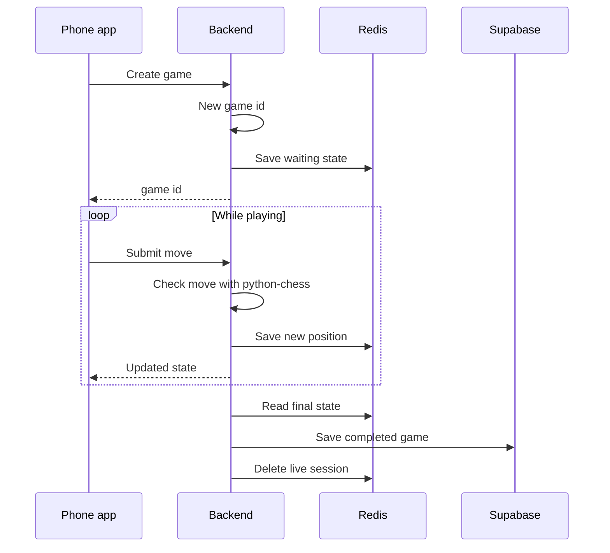

# Friend chess in the app (plan)

## Strict todo workflow (required)

Anyone **implementing or extending** this feature—human or agent—must **not** run installs, tests, servers, or edit code until there is a **tracked todo list** that matches the work.

1. **Break down work first** — Turn the relevant bullets in this doc (and new scope) into explicit todo items: ordered, checkable, and scoped to what will change.
2. **Mirror in the agent** — Use the session todo tool (or an equivalent checklist) so each step is visible and marked **completed** as you go. No “drive-by” edits outside the listed items unless you add a todo for them first.
3. **Keep this file honest** — For new phases, add rows under frontmatter `todos:` with stable `id` values; set `status` to `pending`, `in_progress`, or `completed`. Completed history in YAML can stay for traceability.
4. **Exception** — Truly trivial one-off fixes (e.g. typo, single obvious line) may skip a full breakdown **only if** everyone involved agrees in that session; when in doubt, use todos.

Project automation: `.cursor/rules/plan-and-todos-before-execution.mdc` applies the same discipline repo-wide.

## What you’re building

Two logged-in players can start a game together in **your** app (not Lichess). They need a **shared game id** (or a short invite code that points to it). While they play, the **current board and move list** live in **Redis** so reads and writes stay fast. When the game **ends** (checkmate, draw, resign, etc.), the backend saves **one permanent record** in **Supabase** and drops the Redis entry.

The phone app does **not** decide if a move is legal. The **FastAPI** backend does, using **python-chess**, and is the only thing that updates Redis and the database.

## How it feels to use

1. Player A taps “create game” → the server returns a **game id** (and often a short code).
2. Player A shares that with Player B → B taps “join” and enters the id or code.
3. Both see the same position. Each move goes to the server; the server applies it if it’s legal and it’s that player’s turn.
4. When the game ends, the record is saved. If someone opens the game again after that, they get history from Supabase (or a “not found” if it expired before finishing).

## Picture of the data flow



## Where state lives (mental model)

- **While the match is open:** Redis holds everything you need to resume play: FEN, list of moves, whose turn, who is white/black, status (waiting / active / finished), timestamps, optional invite code, and when done—result and reason.
- **After the match is archived:** Supabase holds one row per finished game: same `game_id`, both player ids, move history, final FEN, result, timestamps. You don’t need Postgres “live subscriptions” for active play if Redis is doing that job.

Stale games can **expire** in Redis (e.g. after a day or two) so abandoned lobbies don’t pile up.

## What’s implemented vs optional

- **In this repo today:** backend `/games` routes ([Board-Backend/game/](../../Board-Backend/game/)), `completed_games` in [supabase_schema.sql](../../Board-Backend/supabase_schema.sql), and the friend game UI ([friendGame.tsx](../../nimbus/src/screens/friendGame.tsx)) that **polls** the server every few seconds during play.
- **Optional later:** push updates (SSE or WebSocket) so both phones don’t need to poll. **Lichess** online stays a separate path ([onlineGame.tsx](../../nimbus/src/screens/onlineGame.tsx)).

## For developers

**Environment:** `REDIS_URL` (local example: `redis://127.0.0.1:6379/0`). Backend uses Poetry deps `redis` and `python-chess`.

**HTTP surface (conceptual):**

- Create game → returns new id (and invite code if you use one).
- Join → second player attaches to that id/code.
- Get game → current state from Redis, or missing if finished/expired.
- Move → validate and update Redis; if the game just ended, write Supabase and delete Redis.
- Resign → end game and archive like other endings.

**Edge cases worth keeping:** If Redis is down, creating or moving should fail clearly (e.g. 503)—don’t silently switch to a half-baked database-only path mid-game. When saving the finished game, a **unique** `game_id` in Supabase avoids duplicate rows if finish is retried.

**Deploying (short version):** Run the API behind HTTPS. Run Redis **only on localhost** or inside your VPC—never expose it to the internet. Point the app at a **public** API URL so two people on different networks can play. Keep secrets out of git (SSM, Secrets Manager, etc.).

## Product rules

- Sharing the game id or invite code is how friends find each other.
- Trust the **server** for position and legality, not the client.
- This “friend Redis” mode is **not** the Lichess integration.

## Frontmatter todo template (copy-paste)

Add new work under the `todos:` key in this file’s opening YAML frontmatter (between the first pair of `---` delimiters). Keep **two spaces** before each `-` so indentation stays valid.

**One new item** — paste after the last `- id:` block, before the closing `---`:

```yaml
  - id: short-kebab-id
    content: "Concrete outcome; mention areas like Board-Backend/... or nimbus/... if known"
    status: pending
```

**Several items** — duplicate the three-line block; use `pending` until work starts, then `in_progress`, then `completed`. Prefer **stable** `id` values (don’t rename after merge) so links and history stay meaningful.

**Statuses:** use only `pending`, `in_progress`, or `completed` for consistency with existing rows.
