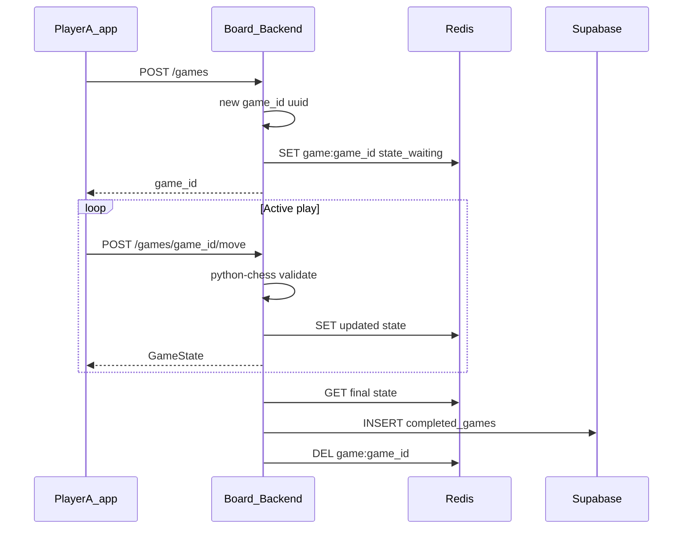

# Online friend chess (Redis live state → Supabase archive)

**Read this doc top-down:** step-by-step first, then optional reference. Machine-checkable todos live in the YAML block above.

---

## Step-by-step plan

### A. Already shipped (checklist)

1. **Redis** — `REDIS_URL`, FastAPI lifespan client, keys `game:{id}` + TTL, `game:shadow:{id}`, per-game lock on join/move/resign.
2. **API** — `POST /games`, `POST /games/join`, `GET /games/{id}`, `POST /games/{id}/move`, `POST /games/{id}/resign`, completed-game list/detail.
3. **Rules** — `python-chess` validates every move; server owns FEN; white/black seats (black not overwritten once taken).
4. **Finish** — Checkmate/draw/resign → upsert `completed_games` → delete Redis game + invite + shadow.
5. **Abandoned** — After live key TTL, sweep finds orphan shadows → insert `abandoned` / `expired`. **Setup:** root `README.md` (Supabase §2 + `ABANDONED_GAME_SWEEP_SEC`); legacy DBs run [`002_completed_games_abandoned.sql`](../../Board-Backend/supabase/migrations/002_completed_games_abandoned.sql).
6. **App** — [friendGame.tsx](../../nimbus/src/screens/friendGame.tsx): lobby, invite code, play, **polling** ~2.5s while active.
7. **History** — [onlineFriendGameHistory.tsx](../../nimbus/src/screens/onlineFriendGameHistory.tsx) / [onlineFriendGameReview.tsx](../../nimbus/src/screens/onlineFriendGameReview.tsx).

### B. What to do next (recommended order)

| Step | What | Why |
|------|------|-----|
| **1** | **Deep links** — open app on a URL / universal link with `game_id` (React Navigation + iOS/Android config) | Friends tap a link instead of pasting codes |
| **2** | **Production hardening** — TLS (nginx/Caddy), narrow CORS, secrets in SSM/Secrets Manager, Redis not public | Safe deploy (see [Deployment on EC2](#deployment-on-ec2) below) |
| **3** | *(Optional)* **Push sync** — SSE or WebSocket (+ optional Redis Pub/Sub) | Fewer polls, snappier UI, better battery |
| **4** | *(Optional)* **Redis Lua / WATCH** — atomic compare-and-set on game JSON | Only if lock becomes a bottleneck at scale |

### C. One-page game flow (mental model)

1. White taps **Create** → API returns `game_id` + **invite code** → Redis `game:{id}` = waiting.
2. Black joins with code → Redis updated → **active**; both poll **GET** until position changes.
3. Each **move** → API locks, loads JSON, validates SAN, writes Redis (and shadow); terminal → **Supabase row** + Redis cleanup.
4. If nobody touches the game for **48h** → live key expires → **sweep** writes **abandoned** if needed, using shadow metadata.

### D. Where the code lives

| Area | File(s) |
|------|---------|
| HTTP routes | [game/routes.py](../../Board-Backend/game/routes.py) |
| Redis + archive + sweep | [game/service.py](../../Board-Backend/game/service.py) |
| Models | [game/models.py](../../Board-Backend/game/models.py) |
| Redis + sweep timer | [api.py](../../Board-Backend/api.py) (`ABANDONED_GAME_SWEEP_SEC`) |
| DB schema | [supabase_schema.sql](../../Board-Backend/supabase_schema.sql), [migrations/](../../Board-Backend/supabase/migrations/) |
| Mobile play | [friendGame.tsx](../../nimbus/src/screens/friendGame.tsx) |
| Lichess (separate) | [onlineGame.tsx](../../nimbus/src/screens/onlineGame.tsx) |

---

## Reference (detail)

### Target architecture (your preference)

- **`game_id`**: Opaque id (UUID) created when a game is created; clients share it (or a short invite code that maps to it) to join the same session.
- **Redis**: **Authoritative store while the game is active**—serialize something matching `GameState` (plus `white_player_id` / `black_player_id`, `side_to_move`, etc.) under e.g. `game:{game_id}`. Every move: read–validate–write in one logical update (use a short Redis transaction or Lua script later if you need strict concurrency).
- **Database (Supabase)**: **Persist only when the game is done**—insert one row with final `move_history`, ending `fen`, result, both player ids, timestamps. Then **remove** the Redis key (or let it TTL out after a short grace period if you want replay buffer).

### Redis payload shape

Store JSON (or MessagePack) per `game:{game_id}` including at least:

- `game_id`, `fen`, `move_history` (list of SAN or UCI), `status` (`waiting` | `active` | `finished` | `aborted`), `side_to_move`
- `white_player_id` / `black_player_id` (or usernames if you prefer stable app identifiers)
- `created_at`, `updated_at` (ISO strings)
- Optional: `invite_code` for short join links
- On terminal: set `result`, `finished_reason` before archiving

**TTL:** Live key `game:{id}` uses 48h inactivity TTL. **Abandoned analytics:** `game:shadow:{id}` (longer TTL) + periodic sweep inserts `completed_games` with `result=abandoned`, `finished_reason=expired` (see migration 002 for nullable `black_player_id`).

### Database (Supabase) — completed games only

Table e.g. **`completed_games`** (name flexible):

- `game_id` (uuid, unique) — same id clients used in Redis
- `white_player_id`, `black_player_id` (FK → `users`; `black_player_id` nullable for expired lobbies)
- `move_history` (jsonb), `final_fen` (text)
- `result`, `finished_reason` (resign, checkmate, draw, abort)
- `started_at`, `finished_at`

No need for Realtime on Postgres for **active** play if Redis is the hot path; optional later for “recent finished games” lists.

### Backend (FastAPI)

- **Poetry**: `redis`, `python-chess`.
- **Env**: `REDIS_URL` (e.g. `redis://localhost:6379/0` or managed Redis).
- **Endpoints (sketch)**:
  - `POST /games` → create `game_id`, seed Redis, return `{ "game_id": "..." }`.
  - `POST /games/join` (body: `game_id` or invite code) → attach second player in Redis.
  - `GET /games/{game_id}` → read Redis; `404` if missing (finished and deleted, or expired).
  - `POST /games/{game_id}/move` → validate turn + legality, update Redis, if terminal then **flush to Supabase + DEL Redis**.
  - `POST /games/{game_id}/resign` (optional MVP+) → set finished, flush to DB.

**Concurrency:** Two simultaneous moves are rare but possible. **Shipped:** per-game lock (`lock:game:{id}`) serializes mutating requests. **Optional (see todo `redis-concurrency-lua`):** Redis `WATCH`/`MULTI`/`EXEC` or a **Lua** script to compare-and-set `updated_at` / version inside one atomic Redis step, reducing lock key traffic at very high concurrency.

### Mobile (Nimbus)

- Screens use **`game_id`** from create/join response or deep link.
- **MVP sync:** Poll `GET /games/{game_id}` every 2–3s while `status` is active (Redis makes this cheap).
- **v2:** FastAPI subscribes to Redis Pub/Sub per `game_id` on each move and pushes **SSE** (you already use EventSource for Lichess)—optional.

### Operational notes

- **Redis down:** Define behavior (fail create/move with 503; no silent fallback to DB mid-game unless you implement dual-write—avoid for MVP).
- **Idempotent archive:** On finish, use `game_id` unique constraint in Supabase so double-finish does not duplicate rows.

### Deployment on EC2

You can run the friend-chess stack on a single EC2 instance (MVP) or split Redis later.

- **API:** Run Uvicorn/Gunicorn behind **nginx** or **Caddy** on **443** (TLS). Security group: allow **80/443** from the internet; do **not** expose Redis publicly.
- **Redis:** Same instance (Docker `redis:7-alpine` or `apt install redis`) listening on **`127.0.0.1:6379`** only; `REDIS_URL=redis://127.0.0.1:6379/0` in the backend env. For production scale, move to **ElastiCache** and set `REDIS_URL` to that endpoint (VPC-only).
- **Env on the instance:** `SUPABASE_URL`, `SUPABASE_KEY`, `REDIS_URL`, JWT/secret vars, `GOOGLE_CLIENT_ID`, Lichess vars as today—use **SSM Parameter Store** or **Secrets Manager**, not committed `.env`.
- **Supabase:** Stays hosted; no change except your backend now calls it from EC2’s public egress.
- **Mobile app:** Set **`API_BASE_URL`** (or equivalent) to `https://your-domain` so friends on any network hit the same server (not `localhost` or LAN IP).
- **CORS:** Tighten from `*` to your app’s scheme/deep-link origins before production.

### Design choices (unchanged intent)

- **Friend discovery:** share `game_id` or short invite code stored in the Redis blob.
- **Security:** Server-only FEN; moves validated with **python-chess**; never trust client position.
- **Lichess mode** stays separate from this Redis friend flow.

**Summary:** **`game_id`** is the handle, **Redis** holds live state, **Supabase** holds finished + abandoned history.
