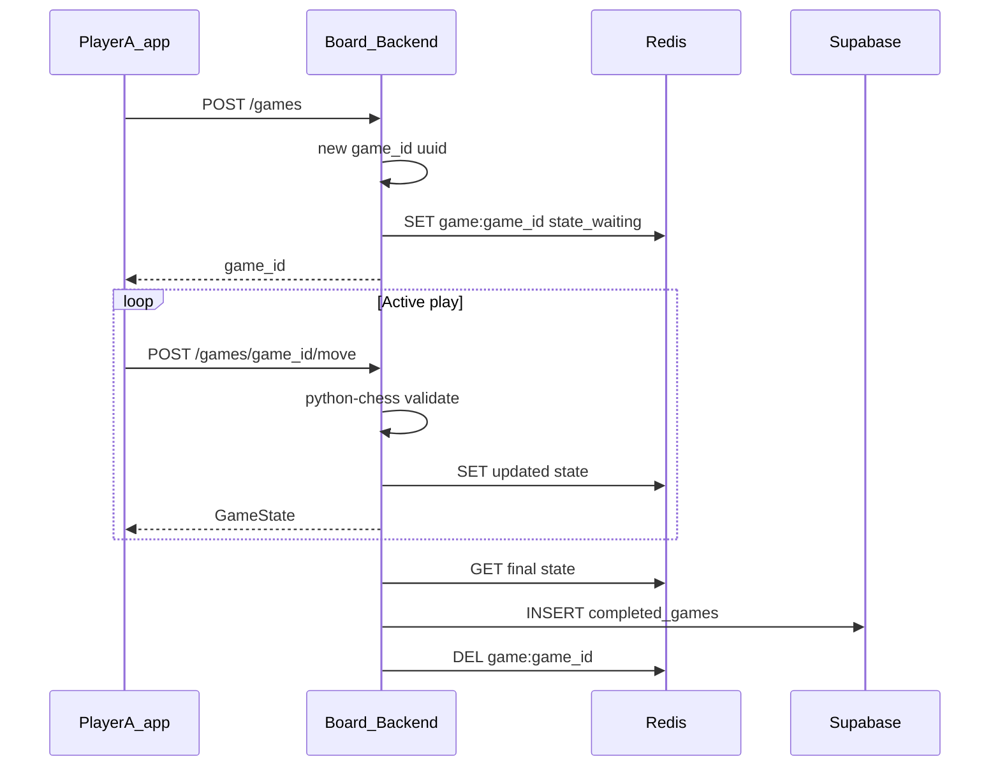

# Track game state for in-app friend games (Redis + game_id, DB on completion)

## Current codebase

- [Board-Backend/game/models.py](../../Board-Backend/game/models.py) defines `GameState` and `MoveRequest` (FEN, `move_history`, `player_ids`, `status`) but they are **not wired** into [Board-Backend/api.py](../../Board-Backend/api.py).
- [Board-Backend/supabase_schema.sql](../../Board-Backend/supabase_schema.sql) defines `users`, `lichess_users`, and `completed_games`.
- [nimbus/src/screens/onlineGame.tsx](../../nimbus/src/screens/onlineGame.tsx) is **Lichess-only**; local play uses in-memory `chess.js` only.

## Target architecture (your preference)

- **`game_id`**: Opaque id (UUID) created when a game is created; clients share it (or a short invite code that maps to it) to join the same session.
- **Redis**: **Authoritative store while the game is active**—serialize something matching `GameState` (plus `white_player_id` / `black_player_id`, `side_to_move`, etc.) under e.g. `game:{game_id}`. Every move: read–validate–write in one logical update (use a short Redis transaction or Lua script later if you need strict concurrency).
- **Database (Supabase)**: **Persist only when the game is done**—insert one row with final `move_history`, ending `fen`, result, both player ids, timestamps. Then **remove** the Redis key (or let it TTL out after a short grace period if you want replay buffer).

## Redis payload shape

Store JSON (or MessagePack) per `game:{game_id}` including at least:

- `game_id`, `fen`, `move_history` (list of SAN or UCI), `status` (`waiting` | `active` | `finished` | `aborted`), `side_to_move`
- `white_player_id` / `black_player_id` (or usernames if you prefer stable app identifiers)
- `created_at`, `updated_at` (ISO strings)
- Optional: `invite_code` for short join links
- On terminal: set `result`, `finished_reason` before archiving

**TTL:** Set `EXPIRE` on the key (e.g. 24–48h) so abandoned games do not live forever; **aborted/expired** games may either skip DB insert or insert a row with `status=aborted` for analytics—product choice.

## Database (Supabase) — completed games only

Table e.g. **`completed_games`** (name flexible):

- `game_id` (uuid, unique) — same id clients used in Redis
- `white_player_id`, `black_player_id` (FK → `users`)
- `move_history` (jsonb), `final_fen` (text)
- `result`, `finished_reason` (resign, checkmate, draw, abort)
- `started_at`, `finished_at`

No need for Realtime on Postgres for **active** play if Redis is the hot path; optional later for “recent finished games” lists.

## Backend (FastAPI)

- **Poetry**: `redis`, `python-chess`.
- **Env**: `REDIS_URL` (e.g. `redis://localhost:6379/0` or managed Redis).
- **Endpoints (sketch)**:
  - `POST /games` → create `game_id`, seed Redis, return `{ "game_id": "..." }`.
  - `POST /games/join` (body: `game_id` or invite code) → attach second player in Redis.
  - `GET /games/{game_id}` → read Redis; `404` if missing (finished and deleted, or expired).
  - `POST /games/{game_id}/move` → validate turn + legality, update Redis, if terminal then **flush to Supabase + DEL Redis**.
  - `POST /games/{game_id}/resign` (optional MVP+) → set finished, flush to DB.

**Concurrency:** Two simultaneous moves are rare but possible; use Redis `WATCH`/`MULTI`/`EXEC` or a single Lua script to compare-and-set `updated_at` / version to reject stale writes.

## Mobile (Nimbus)

- Screens use **`game_id`** from create/join response or deep link.
- **MVP sync:** Poll `GET /games/{game_id}` every 2–3s while `status` is active (Redis makes this cheap).
- **v2:** FastAPI subscribes to Redis Pub/Sub per `game_id` on each move and pushes **SSE** (you already use EventSource for Lichess)—optional.

## Operational notes

- **Redis down:** Define behavior (fail create/move with 503; no silent fallback to DB mid-game unless you implement dual-write—avoid for MVP).
- **Idempotent archive:** On finish, use `game_id` unique constraint in Supabase so double-finish does not duplicate rows.

## Deployment on EC2

You can run the friend-chess stack on a single EC2 instance (MVP) or split Redis later.

- **API:** Run Uvicorn/Gunicorn behind **nginx** or **Caddy** on **443** (TLS). Security group: allow **80/443** from the internet; do **not** expose Redis publicly.
- **Redis:** Same instance (Docker `redis:7-alpine` or `apt install redis`) listening on **`127.0.0.1:6379`** only; `REDIS_URL=redis://127.0.0.1:6379/0` in the backend env. For production scale, move to **ElastiCache** and set `REDIS_URL` to that endpoint (VPC-only).
- **Env on the instance:** `SUPABASE_URL`, `SUPABASE_KEY`, `REDIS_URL`, JWT/secret vars, `GOOGLE_CLIENT_ID`, Lichess vars as today—use **SSM Parameter Store** or **Secrets Manager**, not committed `.env`.
- **Supabase:** Stays hosted; no change except your backend now calls it from EC2’s public egress.
- **Mobile app:** Set **`API_BASE_URL`** (or equivalent) to `https://your-domain` so friends on any network hit the same server (not `localhost` or LAN IP).
- **CORS:** Tighten from `*` to your app’s scheme/deep-link origins before production.

## Design choices (unchanged intent)

- **Friend discovery:** share `game_id` or short invite code stored in the Redis blob.
- **Security:** Server-only FEN; moves validated with **python-chess**; never trust client position.
- **Lichess mode** stays separate from this Redis friend flow.

This plan matches: **game_id** as the handle, **Redis for live state**, **Supabase for finished-game history**.
