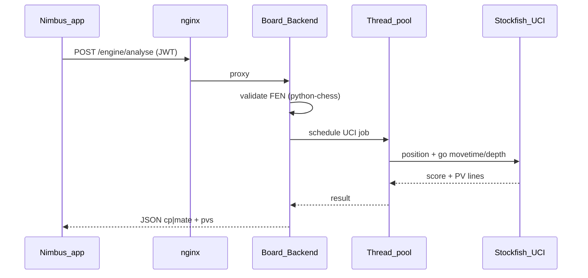

# Stockfish engine and analysis

**Status: planned — not shipped.** Machine-checkable todos live in the YAML block above.

**v1 implementation:** The chosen build path is [stockfish-queue-live-analysis.plan.md](stockfish-queue-live-analysis.plan.md) — Redis LIST queues, separate `engine-worker` container, API enqueue-only (no Stockfish in the API process). The in-process thread-pool MVP (todos below) is **deferred** until queue v1 ships or profiling says otherwise.

**Read this doc top-down:** purpose and design first, then deployment, lifecycle, and implementation map.

---

## Purpose

Run Stockfish on the server behind Board-Backend (BFF): objective eval and principal variations over HTTPS, same origin as the rest of the API. Stockfish is never a public listener. Default is UCI in a subprocess with work off the asyncio event loop (thread pool). Optional later: dedicated internal engine service, Redis queue + worker containers, or SSE for live PV.

---

## Canonical references

| Topic | Location |
|-------|----------|
| Stack / deploy | [docker/stack.yml](../../docker/stack.yml), [scripts/docker-stack.sh](../../scripts/docker-stack.sh), [Board-Backend/docker-compose.yml](../../Board-Backend/docker-compose.yml), [Board-Backend/Dockerfile](../../Board-Backend/Dockerfile) |
| API shell | [Board-Backend/api.py](../../Board-Backend/api.py) |
| JWT / users | [Board-Backend/auth.py](../../Board-Backend/auth.py) |
| SSE + pub/sub pattern to mirror | [Board-Backend/game/routes.py](../../Board-Backend/game/routes.py), `Board-Backend/game/realtime.py` (when friend-game SSE ships) |
| Contracts (when shipping) | `docs/api-routes.md`, `docs/complex-logic.md` |
| Friend chess context | [online-friend-chess.plan.md](online-friend-chess.plan.md) |
| Queue + live analysis (alternate track) | [stockfish-queue-live-analysis.plan.md](stockfish-queue-live-analysis.plan.md) |
| Future engine module (TBD) | `Board-Backend/engine/` (or placement from todo `placement-binary`) |

---

## Design (short)

### Placement

| Option | Description |
|--------|-------------|
| **A (MVP default)** | Threads inside Board-Backend — UCI subprocess + thread pool in the API process |
| **B** | Internal `Board-Engine` HTTP service on the Docker network |
| **C** | Redis queue + worker containers for backpressure and long jobs |

Default **A** until profiling; evolve to **B/C** when CPU or blast radius demands it.

### Binary

- `STOCKFISH_PATH` in env or baked into the image.
- Align Dockerfile / EC2 image with [docker/stack.yml](../../docker/stack.yml) and [scripts/docker-stack.sh](../../scripts/docker-stack.sh).

### Concurrency

- `ThreadPoolExecutor` + `asyncio.to_thread` / `run_in_executor` for all UCI I/O.
- **Invariant:** never block the event loop on engine calls.

### MVP HTTP

- `POST /engine/analyse` — body: `fen`, `movetime_ms` or `depth`, `multipv`.
- Response: centipawn or mate + PV strings.
- Validate FEN with **python-chess** before spawning UCI.

### Profiles

| Profile | movetime / depth | multipv | Notes |
|---------|------------------|---------|-------|
| **Play** | Short | 1 | Hint / eval bar after a move |
| **Analysis** | Deeper | >1 | Multiple lines; optional rate limits / **429** when overloaded |

### Auth

- Only Backend validates JWT on protected routes (same patterns as `/games`).
- Stockfish and workers do not mint tokens.

### One external surface

- Nimbus uses `BASE_URL` only; nginx → Backend.
- No public `ENGINE_URL`.

### Redis keyspace (when queue or SSE is used)

Friend games already use `game:*`, `invite:*`, `lock:game:*`, and (optionally) pub/sub `game:events:*`.

Any engine keys/channels must use a **distinct prefix** (e.g. `engine:*`) or a separate Redis DB index / broker URL so queues and eviction do not clobber live games. Same `REDIS_URL` is fine with prefixes; workers may use `REDIS_BROKER_URL` (e.g. db `1`) if you split broker from game keyspace.

---

## Deployment / roles (condensed)

| Component | Public? | Notes |
|-----------|---------|-------|
| nginx / Caddy | Yes (443, optional 80) | TLS, `proxy_pass` to Backend only |
| Board-Backend | Via edge only | BFF; `/engine/*`; runs or schedules UCI |
| Stockfish (UCI) | No | Subprocess; `STOCKFISH_PATH` |
| Thread pool / optional workers | No | Default pool in API; optional internal worker + queue |
| Redis | No | Optional for SSE/queue; prefix or DB split vs games |
| Board-LLM | Internal | Coach only — **no Stockfish in LLM service** |

**East–west:** Backend ↔ worker ↔ Redis on the Docker network, not the open internet. `nimbus/` is not deployed on EC2.

---

## Request lifecycle (MVP)



### Optional queue topology (later)

Nginx → API enqueues to Redis → worker containers dequeue, run UCI, optionally `PUBLISH` to `engine:events:{id}` → API serves SSE or polls job hash. See [stockfish-queue-live-analysis.plan.md](stockfish-queue-live-analysis.plan.md).

---

## How it feels to use

- **Analysis:** FEN → server search → eval + line(s) in the app.
- **Play:** quick POST after a move for hint / eval bar; async client; server offloads UCI.
- **Live PV (later):** improving depth/score via SSE or pub/sub; nginx read/send timeouts like friend-game SSE.
- **Stale overlap:** bounded movetime; client discards results when FEN changed.

---

## Strict todo workflow

Same rules as [online-friend-chess.plan.md](online-friend-chess.plan.md): tracked todos before installs/tests/code edits; update YAML `pending` → `in_progress` → `completed` as work completes. New phases: add stable `id` rows under frontmatter `todos:`.

**New todo row template:**

```yaml
  - id: short-kebab-id
    content: One sentence, actionable
    status: pending
```

---

## Implementation map

| Todo id | Unlocks |
|---------|---------|
| `placement-binary` | Module path, `STOCKFISH_PATH`, Docker / stack alignment |
| `engine-pool-design` | Pool sizing, max concurrent analyses, graceful shutdown |
| `threading-model` | Executor wiring; invariant: no UCI on event loop |
| `rest-analyse-mvp` | Router + Pydantic + `POST /engine/analyse` + tests |
| `profiles-play-vs-analysis` | Named presets + optional 429 / limits |
| `optional-sse-pv` | Redis notify + `GET .../events` SSE (friend-game pattern) |
| `nimbus-integration` | Screens calling engine API + optional `EventSource` |
| `docs-api-routes` | `docs/api-routes.md`, `docs/complex-logic.md`; see database-schema note below |

---

## Optional follow-ups

- SSE or Redis pub/sub for throttled live info lines (PV streaming).
- Queue + worker replicas; durable job store in Redis hash; scale without scaling API.
- Persisted analysis history in Supabase (product decision).
- Second Redis instance or logical DB for broker vs games.

---

## Product rules

- Trust engine for tactics/eval; server runs Stockfish, not the handset.
- Play stays fast; analysis may be slower — throttle blitz UIs.
- Not a replacement for Lichess unless you deliberately merge flows ([onlineGame.tsx](../../nimbus/src/screens/onlineGame.tsx)).

---

## Persistence (MVP)

- **Stateless:** FEN in, JSON out; no Postgres rows for engine unless product requires history.
- Supabase remains users and completed games.
- Engine subprocess is ephemeral (client retries on instance loss).

### `docs/database-schema.md`

Document new Redis key patterns or TTLs in `docs/database-schema.md` only after the maintainer agrees (repo rule).

---

## Reference (ops and risks)

- **Security group:** inbound 443 (and 80 for ACME if needed); do **not** expose 8000, 6379, worker ports, or a raw engine port to `0.0.0.0`.
- **Reverse proxy:** high read/send timeouts for long-lived SSE streams.
- **Resources:** tune Stockfish `Hash` / `Threads` to container RAM to avoid OOM killing the BFF.
- **GIL:** irrelevant for Stockfish CPU (separate process); threads wrap IPC only.
- **Binary missing:** fail fast at startup or **503** on `/engine/*`.
- **Load balancing:** nginx upstream + stateless `POST /engine/analyse` needs no stickiness; shared Redis if engine uses session keys.
- **Rollback / logs:** same ops story as the rest of the stack (`docker compose logs`, image pin).

For cross-cutting narrative after shipping, prefer `docs/complex-logic.md` over growing this plan file.
