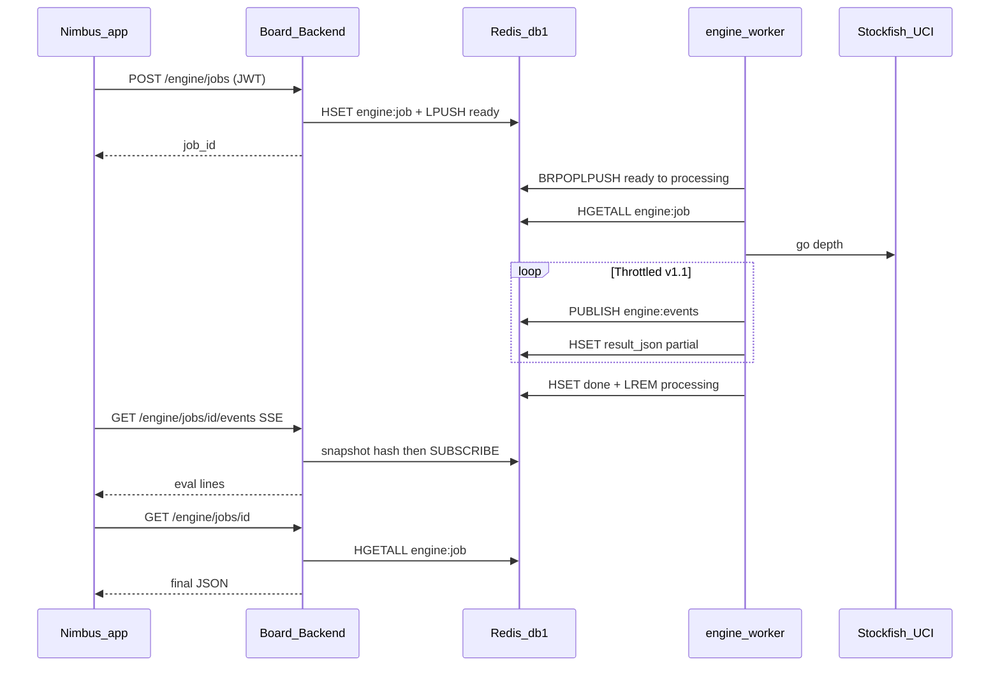

# Stockfish queue + live analysis (build plan)

**Status: planned — not shipped.** This is the **v1 implementation plan**. Machine-checkable todos live in the YAML block above.

**Strict todo workflow (required):** Anyone implementing must mirror these todos in the agent session and update YAML statuses (`pending` → `in_progress` → `completed`) as work completes. **No installs/tests/code edits until todos exist for that slice.**

High-level product context: [stockfish-engine-analysis.plan.md](stockfish-engine-analysis.plan.md). Friend chess Redis keys: [online-friend-chess.plan.md](online-friend-chess.plan.md).

---

## v1 decision: Redis queues only

- **Broker:** Redis **LIST** only. No Celery, no SQS, no Redis Streams in v1.
- **Dequeue pattern:** visibility list — `BRPOPLPUSH` (blocking, with timeout) from `engine:queue:ready` to `engine:queue:processing` — not plain `RPOPLPUSH` (non-blocking; would spin on empty). Worker ACK with `LREM` on success; reclaimer moves timed-out entries from `processing` back to `ready` (or to DLQ after `max_attempts`).
- **Truth for UI:** HASH `engine:job:{job_id}` holds status, latest partial result JSON, fen, attempts, timestamps. Pub/sub is notification only, not storage.
- **Why not raw BRPOP only:** after pop, crash = lost job unless you use processing list + reclaim.

---

## Redis key layout (implement exactly)

| Key / channel | Type | Purpose |
|---------------|------|---------|
| `engine:queue:ready` | LIST | `LPUSH` job_id strings only (payload lives in HASH) |
| `engine:queue:processing` | LIST | `BRPOPLPUSH` destination; reclaim on timeout; `LREM` by job_id |
| `engine:job:{job_id}` | HASH | status, fen, payload_json, result_json, attempts, created_at, updated_at, claimed_at, error, cancel_requested |
| `engine:dedupe:{dedupe_key}` | STRING | value = job_id, TTL e.g. 24h |
| `engine:idempo:{idempotency_key}` | STRING | value = job_id, TTL e.g. 24h |
| `engine:events:{job_id}` | PUB/SUB channel | optional incremental notify; throttle worker publishes |
| `engine:dead:{job_id}` | STRING or HASH | DLQ payload after max attempts |

**Partitioning:** use Redis DB index **1** for all `engine:*` keys if `REDIS_URL` db `0` is reserved for friend games; env `REDIS_ENGINE_URL=redis://host:6379/1`. Same server is fine for v1.

---

## Job payload (stored in `engine:job:{job_id}` HASH)

Serialize as JSON in field `payload_json` (or split across hash fields). Minimum logical shape:

```json
{
  "job_id": "uuid",
  "kind": "position",
  "fen": "...",
  "depth": 20,
  "multipv": 1,
  "profile": "play | analysis",
  "dedupe_key": "sha256:...",
  "enqueued_at": "ISO8601",
  "source_game_id": null,
  "source_ply": null
}
```

- **Live moves:** client sends `fen`; API validates and stores as above (`source_*` optional for UI echo).
- **Past games:** client sends `game_id` + `ply`; API loads `completed_games`, checks user is participant, replays to fen, then stores `kind: position` with optional `source_game_id` / `source_ply` for traceability. **Worker never uses Supabase in v1.**

Queues hold **only job_id** so `LREM engine:queue:processing 1 {job_id}` is unambiguous (compare as string element).

---

## Dedupe and idempotency (server behavior)

1. Compute `dedupe_key` from canonical inputs (see [Reliability rules](#reliability-rules)).
2. Redis `GET engine:dedupe:{dedupe_key}` → if value is `job_id` and that job hash status is not terminal, return that `job_id` (`dedupe_hit: true`).
3. If client sends `Idempotency-Key`, Redis `GET engine:idempo:{key}` → same return rule.
4. Else create `job_id`, `HSET engine:job:{job_id}` (full payload + `status=queued`), `SETEX` dedupe + idempo mappings, `LPUSH engine:queue:ready` the job_id string.

---

## Stockfish workers (setup)

**Split:** Board-Backend **never runs Stockfish**. It only writes `engine:job:*`, `LPUSH`es job_id, and serves GET/SSE. All UCI runs inside the worker process.

### Container and Compose

- **Image:** own Dockerfile (e.g. `Board-EngineWorker/Dockerfile`) based on slim Python; `apt install stockfish` or copy a pinned binary; set `STOCKFISH_PATH`.
- **Service:** `engine-worker` in [docker/stack.yml](../../docker/stack.yml) / [Board-Backend/docker-compose.yml](../../Board-Backend/docker-compose.yml): `depends_on: redis`, no published ports to the host; same Docker network as redis and backend.
- **Env:** `REDIS_ENGINE_URL`, `STOCKFISH_PATH` only. No Supabase in worker if API normalizes archived positions to fen before enqueue.

### Process model (v1)

- **Worker threads:** one main thread runs the dequeue + Stockfish loop (blocking `redis.Redis`, blocking python-chess UCI). Optional second thread runs the reclaimer (Redis only — never call the engine from it).
- **Engine lifecycle:** one long-lived `SimpleEngine.popen_uci(STOCKFISH_PATH)` per process; only the main thread touches UCI in v1. `threading.Lock` around UCI is optional future-proofing; not required if only the main thread runs Stockfish. Alternative: new subprocess per job (slower, stronger isolation).
- **UCI options:** set `Hash` / `Threads` once at startup to fit container RAM; per-job `setoption` only if needed.

### Main loop (build contract)

1. **Claim:** `BRPOPLPUSH engine:queue:ready engine:queue:processing <timeout_sec>` → receive `job_id` (or None on timeout — loop and retry). Use `BLMOVE` with `RIGHT LEFT` if you standardize on Redis 6.2+ and drop `BRPOPLPUSH`.
2. `HGETALL engine:job:{job_id}` → parse payload → validate → `HSET status=running`, set `claimed_at` for reclaimer, bump `attempts` if reclaim.
3. Run Stockfish with `go depth N` or movetime cap from payload.
4. *(Optional v1.1)* On partial info: throttle `PUBLISH engine:events:{job_id}` + `HSET result_json` partial.
5. **Finish:** `HSET` final `result_json`, `status=done`, `LREM engine:queue:processing 1 {job_id}`.
6. **Failure:** transient + `attempts < max` → `LPUSH engine:queue:ready {job_id}`; else `status=failed`, DLQ, `LREM processing`.

### Reclaimer (same container)

Second thread or periodic timer: `LRANGE engine:queue:processing`, then for each `job_id` `HGET claimed_at` / `status`; `LREM` + `LPUSH ready` or DLQ. **Never call Stockfish from this thread.** Same binary, no extra service for v1.

### Shutdown and scaling

- **SIGTERM:** prefer finish current job if a short grace window allows; otherwise `LREM engine:queue:processing 1 {job_id}`, `HSET status=queued`, `LPUSH engine:queue:ready {job_id}` so the job is not stranded in processing. Do **not** `LPUSH ready` without `LREM` from processing first (avoids duplicate list entries).
- **Scale:** `./scripts/docker-stack.sh up` defaults to **3** replicas (`--scale engine-worker=3`); each replica runs the same `BRPOPLPUSH` claim loop; one worker wins each atomic move from ready → processing; `LREM` on done/fail clears processing. Override with `--engine-workers N` or `ENGINE_WORKER_REPLICAS`.

---

## Board-Backend (only enqueue / read)

Add a second Redis client for engine keys when using `REDIS_ENGINE_URL` (e.g. db `/1`): e.g. `app.state.redis_engine`. Friend-game routes keep using `app.state.redis` (`REDIS_URL` / db `0`). Engine routes use **only** `redis_engine` for `engine:*` keys so namespaces never collide.

Handlers should only do fast operations: `HSET` / `LPUSH` / `GET` / pub/sub for SSE — **not** `BRPOPLPUSH` and **not** Stockfish. Match the same short-Redis-op discipline as existing [game/routes.py](../../Board-Backend/game/routes.py) handlers.

### API (FastAPI, Bearer like `/games`)

| Method | Path | Behavior |
|--------|------|----------|
| POST | `/engine/jobs` | Body + optional `Idempotency-Key`; returns `{ job_id, dedupe_hit }` |
| GET | `/engine/jobs/{job_id}` | Read `engine:job:{job_id}`; 404 if missing |
| GET | `/engine/jobs/{job_id}/events` | SSE: subscribe to pub/sub after loading hash snapshot into first `data:` |
| POST | `/engine/jobs/{job_id}/cancel` | Set `cancel_requested=1` on hash; worker checks between UCI steps |

#### POST `/engine/jobs` request body (v1)

| Field | Type | Required | Notes |
|-------|------|----------|-------|
| `fen` | string | if not using archived shortcut | Legal FEN; API validates with python-chess |
| `game_id` | string | for review flow | With `ply`, API resolves to fen then stores `kind: position` in payload |
| `ply` | int | with `game_id` | Half-move index or full-move convention — pick one and document |
| `depth` | int | yes | e.g. 20; cap server-side (max 30) to prevent abuse |
| `multipv` | int | no | default 1 |
| `profile` | string | no | `play` \| `analysis`; may tune default movetime if depth omitted |
| `movetime_ms` | int | no | optional ceiling alongside depth |

**Headers:** `Authorization: Bearer` (same as `/games`). `Idempotency-Key`: optional UUID string.

---

## Job status (state machine)

Terminal states: `done`, `failed`, `cancelled`. Non-terminal: `queued`, `running`.

```text
queued → running → done
              ├→ failed
              └→ cancelled
```

- **failed:** set `error` (short string) on hash; SSE emits terminal event.
- **cancelled:** worker saw `cancel_requested` or operator policy.

### `result_json` shape (worker writes; API/SSE exposes)

Partial (optional v1.1) and final use the same envelope; partial may omit fields.

```json
{
  "job_id": "uuid",
  "fen": "...",
  "status": "running | done | failed",
  "depth": 18,
  "multipv": 1,
  "lines": [
    {
      "uci_pv": ["e2e4", "e7e5", "g1f3"],
      "score_cp": 24,
      "score_mate": null
    }
  ],
  "bestmove_uci": "e2e4",
  "engine_time_ms": 842
}
```

Use `score_mate` (int, plies) when applicable; `score_cp` from White’s perspective (document convention).

**SSE `data:`:** JSON with at least `job_id`, `fen`, `status`, and latest `lines` / scores when present.

---

## Auth, limits, HTTP errors

- **Auth:** all `/engine/*` routes use `get_current_active_user` (or stricter) like [game/routes.py](../../Board-Backend/game/routes.py).
- **Archived resolution:** when `game_id` + `ply` provided, GET-style check that user is white or black on that `completed_games` row before enqueue.
- **Rate limit (recommended):** max N active jobs per user or per IP (429); max queue depth global (503 or 429).
- **422:** illegal FEN or invalid ply for game.
- **404:** unknown `job_id` on GET/SSE/cancel.
- **503:** Redis engine client unavailable (mirror game routes pattern).

**Suggested defaults (document in code):** visibility timeout 120s; `max_attempts` 3; pub/sub throttle ≤10 msgs/s per job_id; max depth 30; job hash TTL 24h after terminal.

---

## Reliability rules

- Every SSE / poll payload includes `fen` and `job_id`; client ignores stale `fen`.
- **SSE:** subscribe to `engine:events:{job_id}` then yield first `data:` from `engine:job:{job_id}` hash (subscribe-then-snapshot pattern).
- **Dedupe keys:** `hash(fen, depth, multipv, profile)` or `hash(game_id, ply, depth, multipv)` — not `job_id`.
- **Retries:** `attempts`, `max_attempts`, DLQ `engine:dead:{job_id}`.
- **Reclaimer:** `LRANGE engine:queue:processing 0 -1` and, for each `job_id`, `HGET claimed_at` / `status`; if `now - claimed_at > visibility timeout` and status still `running`, `LREM engine:queue:processing 1 {job_id}`, then `LPUSH engine:queue:ready {job_id}` or DLQ if `attempts >= max_attempts`. Requires `claimed_at` set at claim time.

---

## Phased delivery (each phase is shippable)

### Phase 0 — Redis + queue plumbing (no Stockfish yet)

- Add `REDIS_ENGINE_URL` (or db `/1`) config next to `REDIS_URL` in Board-Backend.
- Implement helpers: enqueue, claim, ack, reclaim, job hash CRUD.
- **Acceptance:** integration test with fakeredis or test Redis: enqueue → claim → ack → hash reads.

### Phase 1 — Worker + Stockfish + POST/GET job

- Dockerfile/worker entrypoint: Python loop, `STOCKFISH_PATH`, redis sync client.
- `POST /engine/jobs` + `GET /engine/jobs/{id}` on API.
- Worker runs `go depth` / movetime; writes final PV to hash `status=done`.
- **Acceptance:** curl POST job → worker completes → GET returns eval JSON.

### Phase 2 — SSE live updates

- Implement `GET .../events` mirroring [game/routes.py](../../Board-Backend/game/routes.py) SSE pattern (keepalive, disconnect cleanup).
- Worker publishes throttled updates on `engine:events:{job_id}`.
- **Acceptance:** browser or `curl -N` sees first snapshot then incremental events.

### Phase 3 — Nimbus + past game depth 20

- **Live moves:** on new FEN from friend game SSE, POST job, open engine SSE, overlay eval; cancel previous job client-side + server cancel optional.
- **Past games:** from review screen, POST with `game_id`, `ply`, `depth: 20` (API resolves FEN, worker unchanged).
- **Acceptance:** play friend game → eval updates; open completed game → analyze position at depth 20.

---

## Code locations (where to build)

| Area | Path |
|------|------|
| Engine package | `Board-Backend/engine/` — `queue.py`, `jobs.py`, `schemas.py`, `routes.py` |
| Router mount | [Board-Backend/api.py](../../Board-Backend/api.py) at prefix `/engine` |
| Worker | `Board-Backend/engine_worker/` or sibling `Board-EngineWorker/` with Dockerfile + `CMD ["python", "-m", "engine_worker"]` |
| Compose | extend [docker/stack.yml](../../docker/stack.yml) and [Board-Backend/docker-compose.yml](../../Board-Backend/docker-compose.yml) |

---

## Implementation order (after this plan)

1. `REDIS_ENGINE_URL` + `app.state.redis_engine` + Phase 0 helpers (enqueue, job hash).
2. Worker image + Compose service; prove `BRPOPLPUSH` → Stockfish → `HSET done` with manual `LPUSH` of a test job_id.
3. POST / GET `/engine/jobs` wired to enqueue + read hash.
4. SSE route + worker `PUBLISH` throttling.
5. Nimbus + archived depth-20 path.

---

## Dependencies

- **python-chess** on API (validation) and worker (engine driver).
- **Stockfish binary** in worker image (`apt install` or `COPY`).
- **Poetry:** add redis if worker is separate package; reuse existing redis client patterns from game code.

---

## Out of scope for v1 (explicit deferrals)

- Celery, Dramatiq, RQ, Redis Streams.
- Second physical Redis container (use logical db index first).
- Full-game batch precompute (chunked batch = later todo).
- In-process Stockfish in Board-Backend (see [stockfish-engine-analysis.plan.md](stockfish-engine-analysis.plan.md) option A — deferred).

---

## Documentation follow-up

- After each phase that exposes HTTP: update `docs/api-routes.md`.
- Cross-cutting flows: `docs/complex-logic.md`.
- `docs/database-schema.md`: ask maintainer before documenting new Redis keys.

---

## Definition of done (close the plan)

Ship when **all** of the following are true:

1. `REDIS_ENGINE_URL` wired; `app.state.redis_engine` used for all `engine:*` keys.
2. Worker container runs `python -m engine_worker`, completes a depth-20 job from `LPUSH` + POST, `LREM` ack is correct under kill/restart (reclaimer verified once manually).
3. POST / GET `/engine/jobs` + GET `.../events` with subscribe-then-snapshot; nginx/proxy timeouts documented if applicable.
4. Nimbus: live friend position triggers new job + SSE; completed game review can analyze at least one ply at depth 20.
5. Dedupe + `Idempotency-Key` return same `job_id` on repeat POST.
6. `docs/api-routes.md` and `docs/complex-logic.md` updated; `docs/database-schema.md` only if maintainer approved Redis section.
7. Mark frontmatter `definition-of-done` and phase todos **completed**.

---

## Frontmatter todo template (copy-paste)

```yaml
  - id: short-kebab-id
    content: "Concrete outcome; cite Board-Backend/... or nimbus/..."
    status: pending
```

---

## Topology



*Last updated: 2026-05-30 — v1 build plan complete for implementation.*
